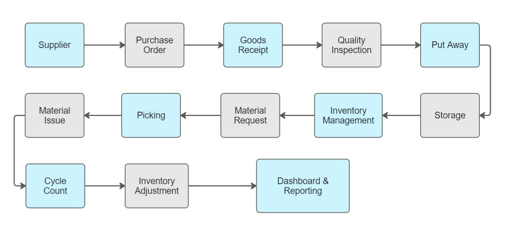

# Warehouse Operations Portfolio

English

A Microsoft Excel projects that simulate real warehouse operations in a heavy equipment manufacturing environment.

This portfolio was created to demonstrate my understanding of warehouse operations, inventory management, and business workflows using Microsoft Excel.

The projects focus on practical warehouse processes such as Receiving, Put Away, Storage, Material Issue, Inventory Control, and Stock Opname.

All projects in this portfolio are simulations created to apply warehouse management concepts through practical case studies using Microsoft Excel. The portfolio focuses on demonstrating an understanding of warehouse workflows, data management, and operational problem-solving with Excel.

## Introduction
This project is a Microsoft Excel based simulation of warehouse operations in a heavy equipment manufacturing environment. It was created to demonstrate my understanding of warehouse workflows, inventory management, and operational processes.

## Project Background
This project was created as part of my self-directed learning in warehouse operations. It simulates key warehouse processes including Receiving, Put Away, Storage, Material Issue, and Stock Opname using Microsoft Excel to develop a practical understanding of warehouse workflows and inventory management.

## Project Objectives
The objectives of this project are:
-	To simulate real world warehouse operations using Microsoft Excel, covering the complete workflow from receiving goods to inventory reporting.
-	To apply inventory management concepts such as stock movement tracking, stock balance maintenance, and data reconciliation.
-	To develop practical Excel skills for organizing, processing, and analyzing warehouse operational data efficiently.
-	To build a solid understanding of warehouse business processes that serves as a strong foundation for working with ERP and WMS systems.
-	To document and showcase a practical warehouse case study using Excel

## Business Process

### Overview
This project simulates the core warehouse operational workflow commonly found in a heavy equipment manufacturing environment. Rather than focusing on building an ERP or Warehouse Management System (WMS), the project aims to develop a practical understanding of the warehouse business processes that are commonly managed through these systems. Microsoft Excel is used as a simulation tool to model the flow of warehouse data across different operational activities, providing a practical representation of real world warehouse operations.

...

### Warehouse Operations Business Process
The following diagram illustrates the end-to-end warehouse operational workflow simulated throughout this project.

  

### Process Description

| Process | Description |
|----------|-------------|
| Supplier | Approved suppliers provide raw materials or spare parts required for warehouse operations. |
| Purchase Order | A Purchase Order (PO) is created to authorize the purchase of materials from suppliers. |
| Goods Receipt (Receiving) | Incoming materials are received, verified against the Purchase Order, and recorded into inventory. |
| Quality Inspection | Received materials are inspected to ensure they meet quality requirements before being accepted into inventory. |
| Put Away | Approved materials are assigned and transferred to their designated storage locations. |
| Storage | Materials are stored in warehouse locations until they are required for operational use. |
| Inventory Management | Inventory records are maintained to monitor stock levels, locations, and material movements. |
| Material Request | Internal departments submit requests for materials required for operational or production activities. |
| Picking | Requested materials are picked from their storage locations according to the material request. |
| Material Issue | Picked materials are issued and recorded as outbound inventory transactions. |
| Cycle Count | Periodic physical inventory counting is performed to verify inventory accuracy. |
| Inventory Adjustment | Inventory records are updated when discrepancies are identified during the cycle count process. |
| Dashboard & Reporting | Warehouse operational data is summarized into reports and dashboards for inventory monitoring and decision-making. |

---
Bahasa Indonesia

Sebuah proyek Microsoft Excel yang mensimulasikan operasional gudang di lingkungan manufaktur alat berat.

Portofolio ini dibuat untuk menunjukkan pemahaman saya mengenai operasional gudang, manajemen persediaan, serta alur proses bisnis menggunakan Microsoft Excel.

Proyek-proyek di dalamnya berfokus pada proses-proses utama di gudang, seperti Receiving, Put Away, Storage, Material Issue, Inventory Control, dan Stock Opname.

Seluruh proyek merupakan simulasi yang dibuat sebagai sarana menerapkan konsep warehouse management ke dalam studi kasus menggunakan Microsoft Excel. Portofolio ini berfokus pada pemahaman alur proses warehouse, pengelolaan data, dan penyelesaian masalah operasional melalui Excel.
